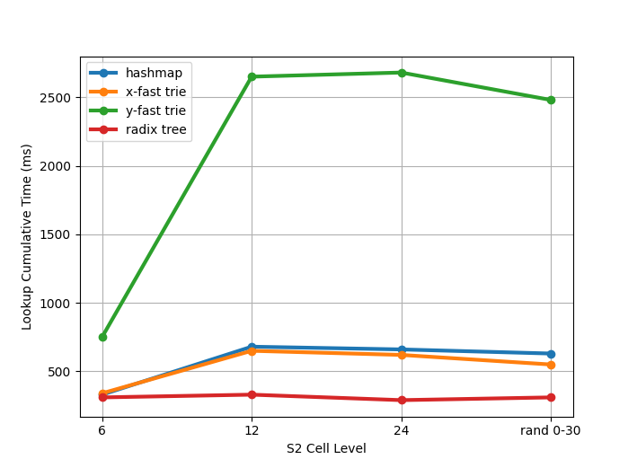

I found myself wondering about how fast various in-memory data structures perform at lookups of S2 indexed data. Specifically, I wondered if trie based structures could outperform a typical hashmap approach, since the S2 cell indices of nearby points will have significant prefix overlap ([see S2 cell numbering documentation](https://s2geometry.io/devguide/s2cell_hierarchy.html)).

The trie-based data structures of interest to me here are
1. [Radix tree](https://en.wikipedia.org/wiki/Radix_tree)
2. [X-Fast Trie](https://en.wikipedia.org/wiki/X-fast_trie)
3. [Y-Fast Trie](https://en.wikipedia.org/wiki/Y-fast_trie)

The *-fast tries are particularly intriguing because of their O(log log n) lookup complexity. Unsurprisingly, this comes with some large constants.

The following graph shows benchmark results for 10M uniform random lookups of 1M lat/lng point objects. The 1M points are sampled uniformly within randomly sampled rectangular regions. The x-axis is the S2 cell level at which the 1M points were indexed ("rand 0-30" indicates that an S2 level was chosen uniformly at random).

All non-hashmap data structures tested here require significantly more memory (~5x more in these benchmarks). This is a known problem with traditional radix trees, which typically have a large number of unused children nodes; various enhancements have been made to compress the tree
- [Adaptive Radix Tree (ART)](https://db.in.tum.de/~leis/papers/ART.pdf) 
- [Pruning Radix Tree](https://github.com/wolfgarbe/PruningRadixTrie)
